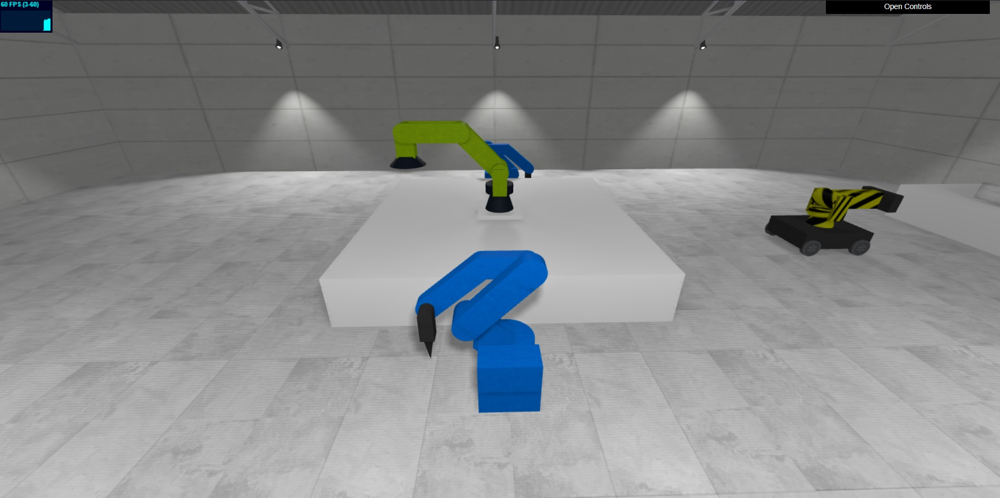
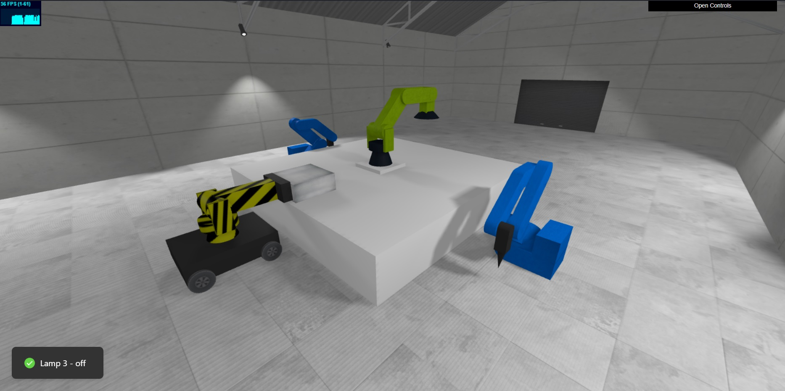
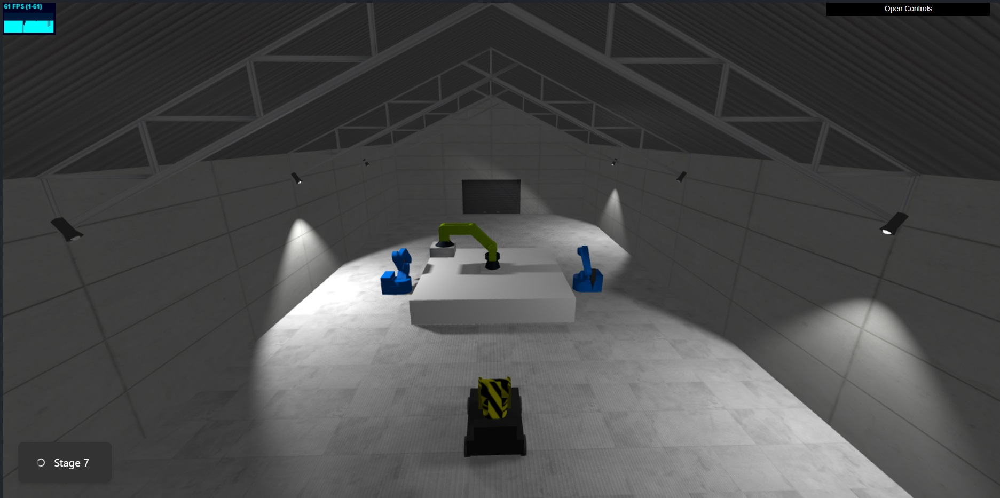
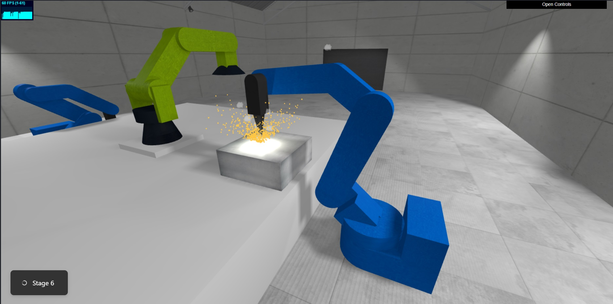

# Three.js Welding robots animation

## About the project

The project is a interactive animation showing 4 robots passing an element and welding it. The user can control the different stages of the animation using the left and right arrows, right arrow moves animation forward, left arrow retracts it. With the help of buttons 1 - 6 you can switch specific lamps. Arrow up and down control the brightness of the ambient light. Holding down the lamp number and pressing "+" or "-" also brightens or dims the lamp. User can also release the camera and view the scene from their own perspective using the mouse. Animations are made in the Green Sock Animation Platform (gsap.js) library.

Live - [Visit demo](https://three-js-welding-robots-animation.vercel.app/)

## Build with

## Pictures

## How to run

1. Clone the repo
   `git clone https://github.com/JudiJudi6/Three-js-welding-robots-animation.git`

2. Install NPM packages
   `npm i`

3. To run app
   `npm run dev`
